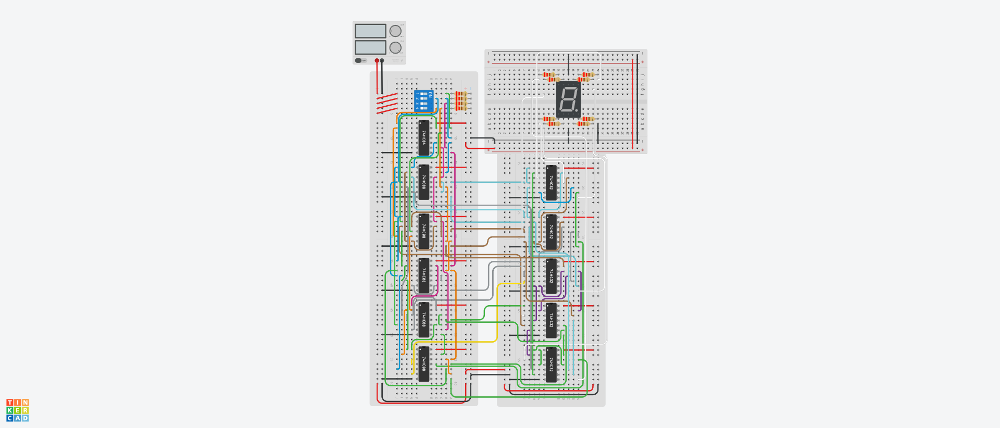

# Circuit 1: 5421 BCD to 7-Segment Display
This circuit takes a 5421 BCD value via a DIP switch and outputs the number using a 7 segment common cathode display.
My goal for this circuit was to create an optimized circuit using only AND, OR, and NOT gates, optimizing for the fewest number of gates.

## Finding and Optimizing Boolean Expressions
You can see my work for the truth table, Quine Mccluskey Method, and PI table [Here](https://docs.google.com/spreadsheets/d/1PlTn39krXxWB7WWezo5svpjv6j29pWgZNtsgPc2RA4U/edit?usp=sharing)

# The Truth Table
My input comes from a 4 input DIP switch, so 5421 BCD has some repeat values and some values out of bounds for a 7 segment display. 
I chose to include the repeat values to allow more flexibility for the user; both 0101 and 1000 in 5421 BCD decode to 5 in decimal, so I want the display to show 5 for both of these inputs.
For out of bounds issues, I chose to leave the screen blank, so any input decoding to 10 or greater will have a 0 output for all segments. 
I think this is a clear way to display an overflow, the caveat being that the user must know the diplay works properly to trust these outputs. 
If I wanted to extend the output to two digits, these values could decode to the ones digit, but I think that would be confusing for this circuit since there is only one output and overflow wouldn't be obvious.

# Circuit Optimization
As a baseline, I found minimum SOP and POS expressions for all 7 digits. The resulting total for SOP was 75 gates, and the total for POS was 87 gates. 
This number could probably be lowered by a few gates each by factoring, but the end result wouldn't be significantly fewer gates.
This process also did not yield many shared terms, which is the main optimization I am hoping to take advantage of.

Next, I used the Quine McCluskey Method to create a table to find the prime implicants for all of the terms, and a Prime Implicant table to determine which terms to pick.
Once I created the prime implicant table, I first found any essential prime implicants and included them in any outputs that inlcuded them as prime implicants.
At this point, I had many prime implicants to choose from and many outputs to cover, so I had to find a way to pick implicants that would be shared by the most outputs and would use the fewest gates.
The process I used isn't obvious just by looking at the table, so I'll detail it here.

I simply created a new column that counted the number of minterms in each row. I duplicated the table and, with this new table, I deleted the rows and columns containing the essential prime implicants.
This left me with the minterms remaining and the prime implicants available to cover those minterms. 

I then looked to my sum column and deleted any rows with 0 minterms remaining, since including them would be redundant.
The best PI to include next would be the term that covered the most minterms, since eliminating the greatest number of minterms each step would eventually give the fewest expressions total.
In the event of a tie, I chose the term furthest down the table, since the table was structured with the biggest terms at the bottom (requiring the fewest gates).
Once I selected this PI, I included it in the expression for each output that included it, and deleted the columns and rows containing that PI.
I then repeated this process until every minterm was covered and every output had a valid expression, which meant deleting the whole table.

Once I had expressions for every output, I tested them using a C++ program to ensure that the expressions were logically equivalent to the truth table I began with.
Finally, I used some color coding in the final sheet to find shared terms and terms that were included in other terms.

# Creating the circuit
To create the circuit, I used the table of shared inputs to hand draw a schematic, and then redrew it in an to make it a bit more readable and a bit simpler to follow.

# Components
- 5  Quad AND gate
- 5  Quad OR gate
- 1  Hex Inverter
- 1  DIP Switch x4
- 12 Resistor (220 Ohms)
- 1  Common Cathode 7 Segment Display
- 1 Power Supply

# Conclusion
The final circuit uses a total of 40 AND and OR gates, compared to an initial 75-87 gates using minimum SOP/POS expressions.
[Here](https://www.tinkercad.com/things/4kPxVabsNLW-5421-bcd-remake/editel?returnTo=https%3A%2F%2Fwww.tinkercad.com%2Fdashboard&sharecode=_6BM1DAdI0ck2eHCospywFPOuaUR5FpEVtD0ISYW5iE) 
is a link to the simulation on Tinkercad.
